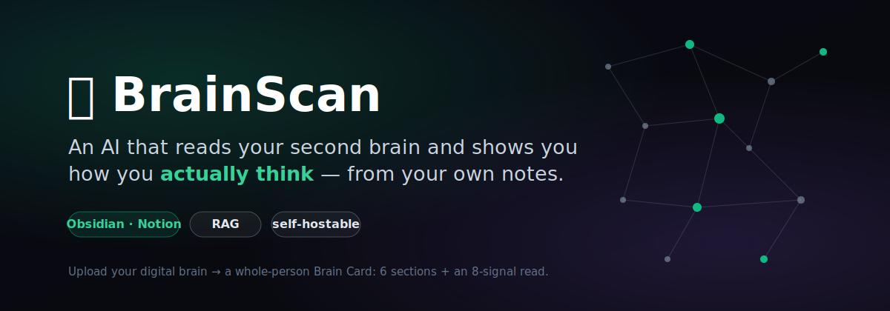
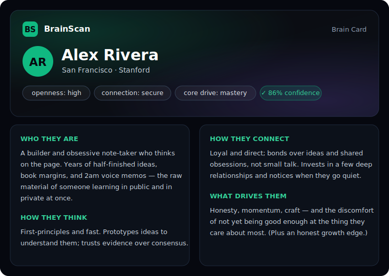

# 🧠 BrainScan

<p align="center"></p>

<p align="center">
  <a href="https://findingfounders-zeta.vercel.app"></a>
  
  
</p>

> An AI that reads your second brain and shows you how you actually think.
>
> ⭐ If this resonates, star the repo — it helps others find it.

Most personality tests are 20 questions. A résumé is a highlight reel. But you've already written thousands of words about how you think, what you're building, and what you care about — in Obsidian, Notion, journals, chat logs.

**BrainScan** ingests your digital brain, runs retrieval-augmented analysis across a dozen dimensions of who you are, and distills it into a **Brain Card**: an honest, whole-person portrait read from your own words.

```
your notes & chats  ──►  embed + index  ──►  RAG retrieval  ──►  LLM analysis  ──►  Brain Card
   (Obsidian/Notion)      (Pinecone)        (13 facets)        (Claude)        (6 sections + signal)
```

It runs as a hosted product **and** as a self-hostable stack — bring your own API keys and scan your own brain locally.

---

## What it produces

<p align="center"></p>

A **Brain Card** with six sections — *Who They Are · How They Think · Career & Ambition · How They Connect · Values & What Drives Them · What They're Looking For* — plus a calibrated **signal** (openness, drive, communication style, social energy, emotional openness, connection style, conflict style, core motivation).

The analysis is **mirror-not-flatter**: specific, evidence-based, and willing to name a real growth edge.

---

## How it works

1. **Ingest** — your vault (a `.zip` of markdown, or the Obsidian plugin) is parsed, chunked, and embedded into a **private Pinecone namespace**. Raw text is never persisted past the analysis call — only vectors are stored.
2. **Retrieve** — for each of **13 facets** of personhood (identity, thinking, emotions, values, relationships, growth, …) a semantic query pulls the most revealing passages from your vault. Results are round-robin merged + deduped into a wide, deep sample (~140 chunks).
3. **Analyze** — Claude reads those passages through a research-backed prompt (Big Five, attachment, self-determination theory) and returns the structured card.
4. **View** — your card renders on the web app; you can re-scan anytime and watch it evolve.

---

## Tech stack

| Layer | Tech |
|---|---|
| Frontend | Next.js 16 (App Router) · Tailwind · deployed on Vercel |
| Backend | FastAPI (Python 3.12) · runs on any Linux box behind nginx |
| Embeddings + vectors | Pinecone hosted inference (`multilingual-e5-large`, 1024-dim) |
| Analysis | Anthropic Claude (Opus) |
| Auth + DB | Supabase (Postgres + Auth) |
| Payments (optional) | Stripe |
| Ingestion | `.zip` upload · or the Obsidian plugin (`obsidian-plugin/`) |

---

## Self-host quickstart

You need accounts for **Anthropic**, **Pinecone**, and **Supabase**. (Stripe is optional — only for paid scans.)

### 1. Clone + keys
```bash
git clone https://github.com/Taran132g/brainscan.git brainscan
cd brainscan
cp backend/.env.example   backend/.env          # fill in your keys
cp frontend/.env.example  frontend/.env.local
```

### 2. Pinecone
Create an index named whatever you set in `PINECONE_INDEX_NAME`, using the **`multilingual-e5-large`** hosted-inference model (1024 dimensions, cosine).

### 3. Supabase
- Create a project; copy the URL + `anon` + `service_role` keys into the env files.
- Run the SQL in `backend/migrations/` **in order** (`0001` → latest) in the Supabase SQL Editor.
- Enable an auth provider (Google OAuth and/or email magic link).

### 4. Backend
```bash
cd backend
python3 -m venv venv && source venv/bin/activate
pip install -r requirements.txt
uvicorn main:app --reload --port 8001
```

### 5. Frontend
```bash
cd frontend
npm install
npm run dev      # http://localhost:3000  (set NEXT_PUBLIC_API_BASE_URL=http://localhost:8001)
```

Sign in, upload a vault `.zip` (or connect the plugin), and hit **Generate**.

### Or run it with Docker

```bash
cp backend/.env.example  backend/.env          # add your keys
cp frontend/.env.example frontend/.env.local   # add Supabase URL + anon key
docker compose up --build
```

Open http://localhost:3000. Supabase + Pinecone are managed services (external) —
only the two app servers run in Docker.

---

## The Obsidian plugin

`obsidian-plugin/` is a desktop Obsidian plugin that zips your vault (minus excluded folders) and sends it straight to your BrainScan backend — no manual export.

**Install (manual / dev):**
1. `cd obsidian-plugin && npm install && npm run build`
2. Copy `main.js` + `manifest.json` into `<your-vault>/.obsidian/plugins/brainscan/`
3. Enable **BrainScan** in Obsidian → Settings → Community plugins.
4. In the plugin settings, paste your token (BrainScan → Settings → Connect Obsidian) and set the **API base URL** to your backend.

> Not yet listed in the official Obsidian community-plugins directory — see the roadmap below.

---

## Connections — *coming soon*

Today BrainScan shows you **yourself**. Next, it connects you to **other minds**.

The Brain Card already captures who someone is at the level that actually matters for connection — how they think, what drives them, how they relate, what they're looking for. We're building a connection layer on top of that:

- **Make your brain discoverable.** Opt in to a shared pool with the Brain Card (or just the sections) you choose to expose. Nothing is public unless you say so.
- **Describe the brain you're looking for.** Not keywords — *traits*. "A builder with high openness and a direct style," "a calm thinking partner who values depth over speed," "a co-founder whose drive matches mine." You tell BrainScan the mind you want to find.
- **Match on substance, not surface.** Matching runs on the underlying signal and the 13 facets — the same evidence-based read the card is built from — so you connect over how people actually think and what they care about, rather than a bio or a job title.
- **Mutual by design.** Connections surface when there's a real fit on both sides, and you stay in control of who can see you and reach you.

It's the natural next step: a card that reads you honestly is also the most honest basis for finding the people you'd genuinely click with — collaborators, co-founders, or just minds worth knowing.

---

## Privacy

- Your notes are converted to embeddings and stored in a **private per-user namespace**. Raw text is not persisted after analysis and is never shared between users.
- Profiles are private or public by your choice; you can hide individual sections.
- Self-hosting means your data and keys never leave your own infrastructure.

---

## Roadmap

- [ ] **Connections** — trait-based matching: find and connect with minds whose Brain Cards fit what you're looking for
- [ ] Publish the plugin to the Obsidian community store
- [ ] Notion / ChatGPT-export / plain-text ingestion
- [x] One-command Docker setup
- [ ] Configurable analysis model (Haiku/Sonnet) for cheaper scans

## License

MIT — do what you want; no warranty. BrainScan is a self-reflection tool, not a clinical or psychological assessment.
